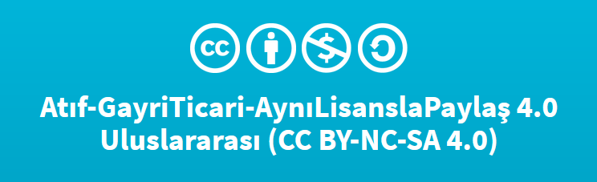
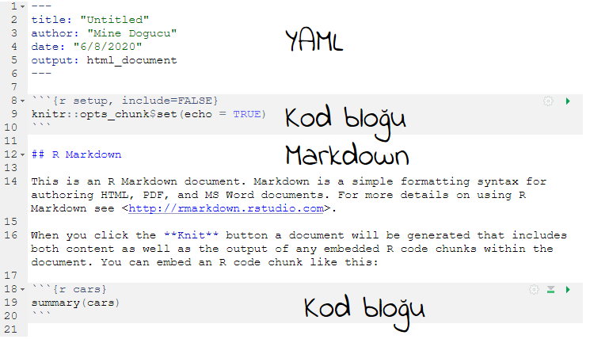

layout: true

<!-- Bu dosya Mine Doğucu tarafından Atıf-GayriTicari-AynıLisanslaPaylaş 4.0 Uluslararası lisansı ile lisanslıdır. Lisans hakkında daha fazla bilgi için: https://creativecommons.org/licenses/by-nc-sa/4.0/legalcode.tr -->
  
<div class="my-header"></div>

<div class="my-footer"> 
 CC BY-NC-SA 4.0 <a href="https://mdogucu.ics.uci.edu">Mine Doğucu</a></div> 

---
class: center, middle


```{r message = FALSE, echo = FALSE, warning = FALSE, message=FALSE}
options(scipen=10000)
library(tidyverse)
library(emojifont)
theme_set(theme_gray(base_size = 22))


```


## Kamu Lisansı

```{r echo=FALSE, out.width='100%'}

```


Lisans hakkında daha fazla bilgiyi [burada](https://creativecommons.org/licenses/by-nc-sa/4.0/legalcode.tr) bulabilirsiniz.


---

class: middle

## Dil Hakkında Not


- Türkçe terimler

---

class: center middle

## `r fontawesome::fa(name = "handshake", fill = "#7b7043")`: Ben


.large[`r fontawesome::fa(name = "chalkboard-teacher", fill = "#7b7043")`] 


--

.large[`r fontawesome::fa(name = "twitter", fill = "#7b7043")`] <a href = "http://twitter.com/MineDogucu">MineDogucu</a>

--


.large[`r fontawesome::fa(name = "book", fill = "#7b7043")`] <a href = "http://mdogucu.ics.uci.edu/teaching/stats115-wi20/main.html">Bayes İstatistiği Dersi</a>


---


class: middle center

## `r fontawesome::fa(name = "handshake", fill = "#7b7043")`: Siz


.large[`r fontawesome::fa(name = "map-marker-alt", fill = "#7b7043")`] 

--

.large[`r fontawesome::fa(name = "r-project", fill = "#7b7043")`] 

--


.large[`r fontawesome::fa(name = "r-project", fill = "#88398a")`] 


---

class: middle

## Markup (Biçimleme) Dilleri


"Mark up" düzeltme veya açıklama amacıyla bir kağıdın üzerine not düşme 


.footnote[çeviri: tureng]


---
class: sub-topic center middle

.sub-topic-note[Biçimleme Dillerine Örnekler]

---

class: middle


## LaTeX


<br>


.pull-left[
```{r eval = FALSE}
$\frac{3}{5}$
```
]

.pull-right[

$\frac{3}{5}$

]

---


class: middle

## HTML (Hypertext Markup Language)

<br>


.pull-left[

```{r eval = FALSE}
<a href = "http://minedogucu.com">
  Mine Doğucu</a>
```
]

.pull-right[

<a href = "http://minedogucu.com">Mine Doğucu</a>

]

---

class: middle


## markdown `r fontawesome::fa(name = "markdown", fill = "#7b7043")`

<br>


.pull-left[


```{r eval = FALSE}
[Mine Doğucu](http://minedogucu.com)
```
]

.pull-right[

[Mine Doğucu](http://minedogucu.com)
]

---

class: subtopic center middle

.sub-topic-note[.strike[R] Markdown]


---

class: center middle

.pull-left[

```{r eval = FALSE}
[Mine Doğucu](http://minedogucu.com)
```
]

.pull-right[

[Mine Doğucu](http://minedogucu.com)
]

---

## Başlıklar


.pull-left[

```{r eval = FALSE}
# Başlık


## Alt Başlık


### Alt-Alt Başlık


#### Alt-Alt-Alt Başlık
```
]

.pull-right[
# Başlık
## Alt Başlık
### Alt-Alt Başlık
#### Alt-Alt-Alt Başlık
]
---


## Vurgulama


.pull-left[

```{r eval = FALSE}
_Merhaba Dünya_ 


__Merhaba Dünya__


~~Merhaba Dünya~~ 

```
]

.pull-right[

_Merhaba Dünya_   

__Merhaba Dünya__ 

~~Merhaba Dünya~~ 
]
---

class: subtopic center middle

.sub-topic-note[R .strike[Markdown]]


---

```{r echo=FALSE, out.width='30%', fig.align='center'}

```


.footnote[Fotoğrafın  (CC BY 2.0) lisansı [t-mizo](https://www.flickr.com/photos/tmizo/7622107930/in/photolist-cBxi8Y-MUWrm-baLoXt-s1xpCk-AecPrJ-a3xdzR-2KMoC-dYSfc3-6ccgek-a3A5eN-AcDqUP-9tt9mD-aACVoF-5jfgYH-5ohiY-9QfYh7-9tt9ue-fcyRqm-Jf9TX-aKinvc-Jf9Ti-5SFHBs-vf9J8y-BDTGX3-TGaxZw-am9SZ-bCdVaU-hYdMq5-g7Qwo-5t3fuP-NfKcx-4uD2q-99DYLL-TErGso-9tt9Br-pNHD5R-bo5RRN-mx5dHp-5QXXGy-a2CznS-xwVX1g-2h6Aix8-6dUJVB-gQAbw-2h6AiuT-5MmoJC-7mULDr-CoPCTG-aFCEpk-NfK9S)'ya aittir.]

```{r echo = FALSE, eval = FALSE}

library(readxl)
url <- "https://data.ibb.gov.tr/dataset/eca4249d-74e6-41ba-b5d0-9627b4c83f9d/resource/d83e94d3-1b28-4c88-9d62-61502c28ea4c/download/rayl-sistemler-hat-bazl-yolculuk-saylar.xlsx"
destfile <- "rayl-sistemler-hat-bazl-yolculuk-saylar.xlsx"
curl::curl_download(url, destfile)
yolculuk <- read_excel(destfile, 
    sheet = 3) %>% 
  rename(yil = Yil,
         m1_hatti = `M1 Hatti`) %>% 
  select(yil, m1_hatti)

file.remove(destfile)
write_csv(yolculuk, "veri/yolculuk.csv")
```

---

## Veri

```{r message = FALSE, echo = FALSE}

yolculuk <- read_csv(here::here("veri/yolculuk.csv"))
```

```{r}
yolculuk
```

.footnote[Veriler İstanbul Büyükşehir Belediyesi'nin [Açık Veri Portalından](https://data.ibb.gov.tr/dataset/eca4249d-74e6-41ba-b5d0-9627b4c83f9d/resource/d83e94d3-1b28-4c88-9d62-61502c28ea4c/download/rayl-sistemler-hat-bazl-yolculuk-saylar.xlsx) indirilmiştir.]
---

## Figure (Şekil)

.left-panel[
```{r eval = FALSE}
ggplot(yolculuk, 
       aes(x = yil, 
           y = m1_hatti)) +
  geom_line()
```
]
.right-panel[

```{r echo = FALSE, fig.height=6, fig.width=9}
ggplot(yolculuk, aes(x = yil, y = m1_hatti)) +
  geom_line()

```
]

---


En son yıl

```{r}
yolculuk %>% 
  filter(yil == max(yil)) %>% 
  select(yil) %>% 
  pull()
```


En son yıldaki yolcu sayısı

```{r fig.height=6, fig.width=9}
yolculuk %>% 
  filter(yil == max(yil)) %>% 
  select(m1_hatti) %>% 
  pull()

```


---

## Analiz Sonrası

- Rapor, makale veya yazı yazma

--

- Web sayfası oluşturma

--


- Sunum yapma


---


## Programlama + Biçimleme (Ayrı Ayrı)

Yöntem:

<table align = "center">

<tr style="font-size:28px">

<td> .large[R'da analiz] <br> `r fontawesome::fa(name = "r-project", fill = "#7b7043")`</td>
<td> .large[Biçimleme] <br> `r fontawesome::fa(name = "file-import", fill = "#7b7043")` 
`r fontawesome::fa(name = "file-word", fill = "#7b7043")` 
`r fontawesome::fa(name = "presentation", fill = "#7b7043")` 
</td>


</tr>

</table>

--

Sorunlar:

- hata yapmaya açık

--

- tekrarlanabilme daha zor.

---


## Programlama + Biçimleme (Birlikte)

<table align = "center">

<tr style="font-size:28px">

<td> .large[R'da analiz]  `r fontawesome::fa(name = "r-project", fill = "#7b7043")` 
ve 
.large[Markdown'da biçimlendirme] `r fontawesome::fa(name = "markdown", fill = "#7b7043")`</td>

</td>


</tr>

</table>

--

<br>
<br>


<table align = "center">
<thead>
<th>Dosya türü</th>
<th>Dosya adı uzantısı  </th>
</thead>

<tr style="font-size:28px">
<td>R </td>
<td>.R</td>
</tr>

<tr style="font-size:28px">
<td>markdown </td>
<td>.md</td>
</tr>

<tr style="font-size:28px">
<td>R Markdown </td>
<td>.Rmd</td>

</table>

---

class: center middle

## Demo

.large[usethis::use_course("mdogucu/rmd-tr")]

---

class: sub-topic center middle

.sub-topic-note[Hatırlatmalar]


---

class: middle

## Demo - Yeni Dosya

- Yeni bir R Markdown dosyası başlatmak için File > New File > R Markdown kullanılabilir.


---
class: middle

## Demo - Knitting (İşlemek)

- Kayıtlı R Markdown dosyasını işlemek için Knit tuşu veya Ctrl/Command + Shift + K kısa yolu kullanılabilir.

```{r echo=FALSE, out.width='80%', fig.align='center'}
knitr::include_graphics('img/knit.png')
```

---


## Demo - Kod bloğu eklemek

- Kod bloğu eklemek için Insert R tuşu veya Ctrl + Alt + I / Cmd + Option + I kısa yolu kullanılabilir.

```{r echo=FALSE, out.width='80%', fig.align='center'}
knitr::include_graphics('img/code-chunk.png')
```

## Demo - Kod bloğunu çalıştırmak

```{r echo=FALSE, out.width='80%', fig.align='center'}
knitr::include_graphics('img/run-code.png')
```


---

## Demo - R Markdown dosyasının farklı parçaları


```{r echo=FALSE, out.width='80%', fig.align='center'}

```

---


class: sub-topic center middle

.sub-topic-note[Örnekler - DEMO]

---


class: sub-topic center middle

.sub-topic-note[Kısa notlar]

---

class: middle

## markdown

- Github'da README.md dosyaları markdown dosyası

- [markdown hatırlatıcı notlar](https://www.markdownguide.org/cheat-sheet/)

- [markdown tablo oluşturucu](https://www.tablesgenerator.com/markdown_tables).

---

## Kod bloğu seçenekleri

Örnek: `echo = FALSE, message = TRUE`

<table align = "center">

<tr>

<td>echo = FALSE</td>
<td>kodun gizlenmesini sağlar.</td>

</tr>

<tr>

<td>message = FALSE</td>
<td>mesajın gizlenmesini sağlar</td>

</tr>

<tr>

<td>warning = FALSE</td>
<td>uyarıların gizlenmesini sağlar.</td>

</tr>

<tr>

<td>error = FALSE</td>
<td>hatalara rağmen dosyanın işlenmesini sağlar.</td>

</tr>

<tr>

<td>eval = FALSE</td>
<td>kodu çalıştırmadan dosyanın işlenmesini sağlar.</td>

</tr>

<tr>

<td> cache = TRUE</td>
<td>kodun çalışmadan en son önbellekteki halini almaya yarar.</td>

</tr>

</table>
 

---
class: middle


## Kod bloklarını isimlendirme


````markdown
`r ''````{r artis-grafigi}
ggplot(yolculuk, 
       aes(x = yil, 
           y = m1_hatti)) +
  geom_line()
```
````


---

class: middle

## Setup (kurulum) kod bloğu

````markdown
`r ''````{r setup, include=FALSE}
knitr::opts_chunk$set(echo = FALSE)
```
````

---

## YAML

YAML - Yet Another Mark up Language - Bir Başka Biçimleme Dili


- themes: cerulean, journal, flatly, darkly, readable, spacelab, united, cosmo, lumen, paper, sandstone, simplex, ve yeti

- styles: tango, pygments, kate, monochrome, espresso, zenburn, haddock, breezedark, ve textmate


---

class: middle

## Kaynaklar

- [R Markdown Kitabı](https://bookdown.org/yihui/rmarkdown/) 

- [RStudio R Markdown dersi](https://rmarkdown.rstudio.com/lesson-1.html)

- [RStudio Hatırlatma Notları](https://rstudio.com/resources/cheatsheets/) Türkçe R Markdown cheatsheet var.

- [W3 schools HTML & CSS](https://www.w3schools.com/html/default.asp)


---


class: sub-topic center middle

.sub-topic-note[R Markdown ailesi]


---

## blogdown

Amaç: Web sitesi oluşturmak

<hr>

Kaynak: [blogdown kitabı](https://bookdown.org/yihui/blogdown/)

<hr>

Örnek: [https://amber.rbind.io/](https://amber.rbind.io/)
<hr>

Kaynak kodu: https://github.com/ProQuestionAsker/websiteSource

---
class: middle

## bookdown

Amaç: Kitap yazmak

<hr>

Kaynak: [bookdown kitabı](https://bookdown.org/yihui/bookdown/)

<hr>

Örnek ve kaynak kodu: [Bookdown örnekleri](https://bookdown.org/)
<hr>

---
class: middle

## xaringan

Amaç: Daha farklı sunumlar yapma

<hr>

Kaynak: [R Markdown kitabı 7. bölüm](https://bookdown.org/yihui/rmarkdown/xaringan.html)

<hr>

Örnek ve kaynak kodu: [Bu sunum](https://github.com/mdogucu/rmd-tr)
<hr>


---
class: middle

## rticles


Amaç: LaTeX destekli makale yazımı

<hr>

Kaynak: [GitHub readme](https://github.com/rstudio/rticles)

<hr>

Örnek ve kaynak kodu: [İstatistik ve Veri Bilimi Eğitiminde Veri Kazıma: Zorluklar ve Fırsatlar](https://github.com/mdogucu/web-scrape)
<hr>

---

class: center middle

## Ödev 

`r fontawesome::fa(name = "bullseye", fill = "#7b7043")` R Markdown ile daha fazla Türkçe kaynaklar oluşturalım.


---

class: center middle 

`r fontawesome::fa(name = "envelope", fill = "#7b7043")` mdogucu@uci.edu
`r fontawesome::fa(name = "twitter", fill = "#7b7043")` MineDogucu
`r fontawesome::fa(name = "github", fill = "#7b7043")` mdogucu
`r fontawesome::fa(name = "link", fill = "#7b7043")`[github.com/mdogucu/rmd-tr](https://github.com/mdogucu/rmd-tr)


